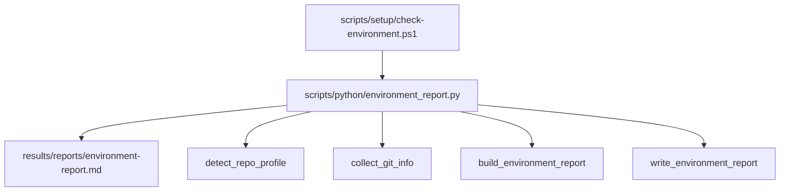
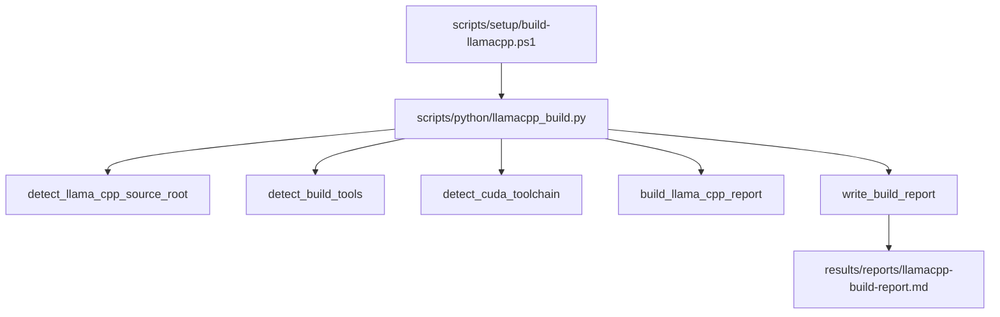
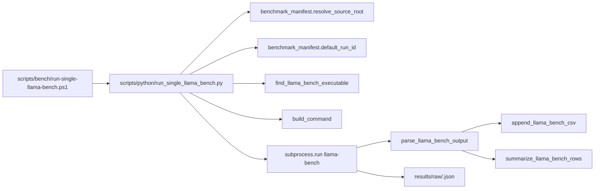
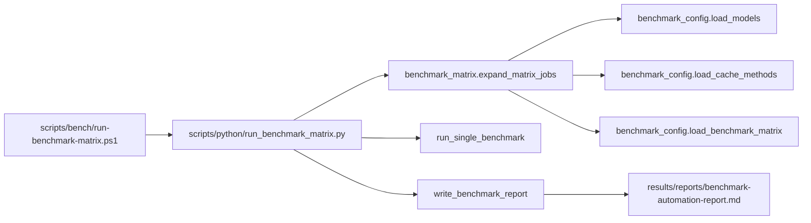
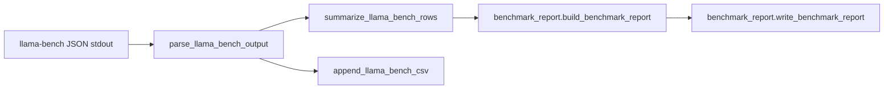

# Benchmark Pipelines

This page groups the benchmark automation scripts in this repo into the main
pipeline operations they support. I wrote it so the flow is easy to skim and
easy to reference later when documenting how the automation works.

## Pipeline Map

| Pipeline                           | Main entrypoint                                                                    | Primary helpers                                                                                                                                                    |
| ---------------------------------- | ---------------------------------------------------------------------------------- | ------------------------------------------------------------------------------------------------------------------------------------------------------------------ |
| Environment readiness              | `scripts/setup/check-environment.ps1`                                            | `scripts/python/environment_report.py`                                                                                                                           |
| llama.cpp build planning           | `scripts/setup/build-llamacpp.ps1`                                               | `scripts/python/llamacpp_build.py`                                                                                                                               |
| Single benchmark execution         | `scripts/bench/run-single-llama-bench.ps1`                                       | `scripts/python/run_single_llama_bench.py`, `scripts/python/benchmark_manifest.py`, `scripts/python/parse_llama_bench.py`                                    |
| Benchmark matrix orchestration     | `scripts/bench/run-benchmark-matrix.ps1`                                         | `scripts/python/run_benchmark_matrix.py`, `scripts/python/benchmark_matrix.py`, `scripts/python/benchmark_config.py`, `scripts/python/benchmark_report.py` |
| Result normalization and reporting | `scripts/python/parse_llama_bench.py` and `scripts/python/benchmark_report.py` | shared by the execution and matrix flows                                                                                                                           |

## 1. Environment Readiness

This pipeline checks whether the repo looks like a buildable llama.cpp-style
checkout and then writes a markdown environment report.

### Helpers involved

- `detect_repo_profile(root)` decides whether the repo looks like a direct
  llama.cpp-style checkout, a RotorQuant research repo, or a hybrid.
- `collect_git_info(root)` reads the git remote, branch, and commit.
- `build_environment_report(root, git_info, profile)` assembles the markdown
  report.
- `write_environment_report(root, output_path, git_info)` writes the report to
  `results/reports/environment-report.md`.

### Output

- `results/reports/environment-report.md`

## 2. llama.cpp Build Planning

This pipeline checks the local build toolchain and generates the build plan for
the selected profile and backend.

### Helpers involved

- `detect_llama_cpp_source_root(root)` finds the llama.cpp source root either
  at the repo root or under `tools/llama.cpp/`.
- `detect_build_tools()` checks for `cmake`, `ninja`, and `cl`, including the
  bundled Visual Studio copies when needed.
- `detect_cuda_toolchain()` checks for `nvcc`.
- `build_llama_cpp_report(root, build_profile, build_backend, flash_attention)`
  writes the command plan for the requested build flavor.
- `write_build_report(root, output_path, build_profile, build_backend, flash_attention)` saves the markdown report.

### Output

- `results/reports/llamacpp-build-report.md`

## 3. Single Benchmark Execution

This pipeline runs one `llama-bench` job, captures the raw output, parses the
metrics, and records a run summary.

### Helpers involved

- `resolve_source_root(root)` locates the llama.cpp source checkout used by the
  benchmark.
- `default_run_id(...)` creates a stable run id from the run parameters.
- `find_llama_bench_executable(root, build_backend, build_profile)` searches
  for the most likely `llama-bench` binary.
- `build_command(...)` assembles the exact command line for the run.
- `summarize_run(...)` standardizes the row that is returned for reporting.
- `parse_llama_bench_output(stdout)` turns `llama-bench` JSON into structured
  rows.
- `append_llama_bench_csv(rows, output_path)` appends parsed rows to the CSV
  history.
- `summarize_llama_bench_rows(rows)` pulls out the summary metrics.

### Output

- `results/raw/<run_id>.json`
- `results/parsed/performance.csv`
- a returned summary row for the report step

## 4. Benchmark Matrix Orchestration

This pipeline expands the YAML configuration into benchmark jobs, runs them one
by one, and then writes the overall benchmark report.

### Helpers involved

- `load_models(path)` reads the benchmark model list from YAML.
- `load_cache_methods(path)` reads the cache method list from YAML.
- `load_benchmark_matrix(path)` reads the matrix settings from YAML.
- `expand_matrix_jobs(root)` builds the cartesian product of models, cache
  methods, build profiles, context sizes, prompt lengths, generation lengths,
  GPU layers, and repetitions.
- `run_single_benchmark(...)` executes each job and returns the normalized row.
- `write_benchmark_report(root, source_root, build_profile, run_summary)`
  produces the matrix summary report.

### Output

- `results/reports/benchmark-automation-report.md`

## 5. Result Normalization and Reporting

This is the shared reporting layer that both the single-run pipeline and the
matrix pipeline use after a benchmark completes.

### Helpers involved

- `parse_llama_bench_output(stdout)` classifies each record as prefill, decode,
  prompt-gen, depth, or other.
- `summarize_llama_bench_rows(rows)` collapses the parsed rows into the summary
  fields used in reports.
- `append_llama_bench_csv(rows, output_path)` preserves parsed history across
  runs.
- `build_benchmark_report(root, source_root, build_profile, run_summary)`
  formats the markdown summary.
- `write_benchmark_report(root, source_root, build_profile, run_summary, output_path)` writes the final report file.

## Short Version

If I want the shortest naming convention for the pipelines, I would document
them like this:

1. Environment Readiness
2. llama.cpp Build Planning
3. Single Benchmark Execution
4. Benchmark Matrix Orchestration
5. Result Normalization and Reporting

That keeps the wording close to what the scripts actually do, while still being
clean enough for a project document or a handoff note.
