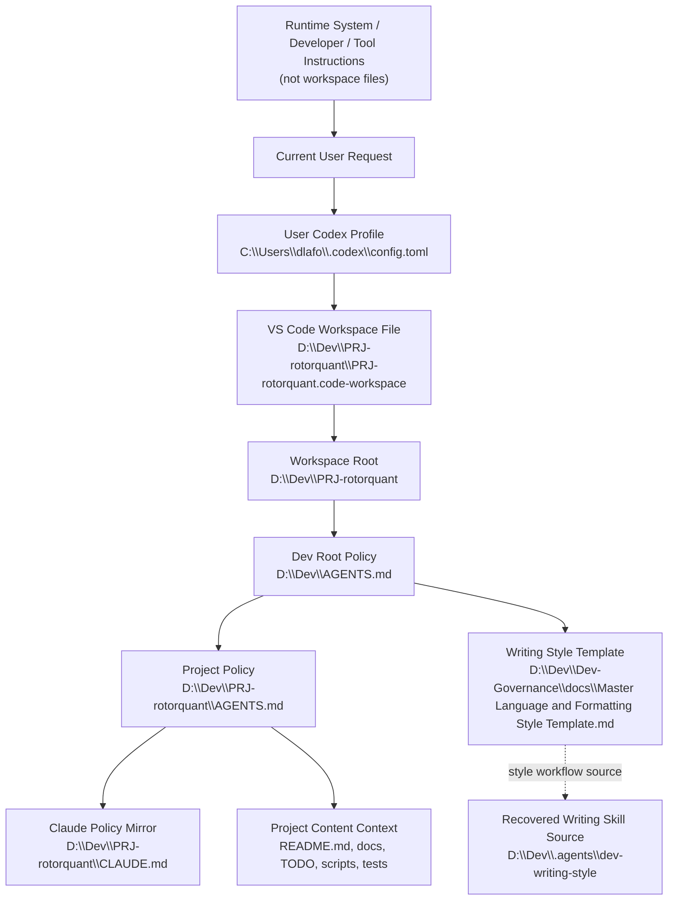
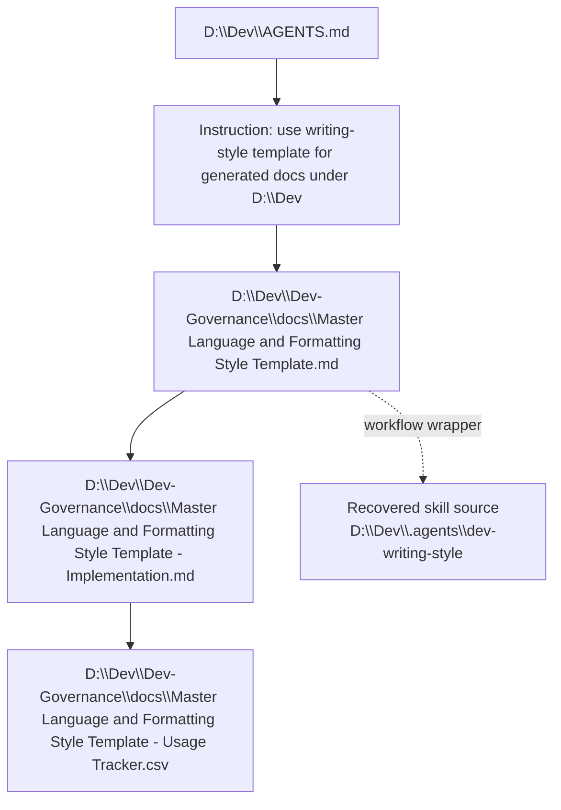

# Codex Workspace Context Policy Chain Map - PRJ-rotorquant

Generated: 2026-06-24

Workspace inspected:

`D:\Dev\PRJ-rotorquant`

VS Code workspace file:

`D:\Dev\PRJ-rotorquant\PRJ-rotorquant.code-workspace`

## Purpose

This document maps the local context and policy sources that a Codex
Agent/Harness is likely to reference when acting inside the RotorQuant VS Code
workspace.

This corrected map is anchored to the actual open VS Code workspace root:

`D:\Dev\PRJ-rotorquant`

It replaces the earlier AI_Agents-focused map for this workspace-context
question. The earlier map described the Codex process workspace I was running in,
not the RotorQuant VS Code workspace that was open in the editor.

## Summary Finding

The effective local policy chain for this workspace is:

1. Runtime system/developer/tool instructions supplied by Codex.
2. The current user request.
3. User-level Codex configuration under `C:\Users\dlafo\.codex`.
4. Dev-root policy: `D:\Dev\AGENTS.md`.
5. Project-local policy: `D:\Dev\PRJ-rotorquant\AGENTS.md`.
6. Project-local Claude policy mirror: `D:\Dev\PRJ-rotorquant\CLAUDE.md`.
7. Project content references such as `README.md`, `docs\`, `TODO-kv-cache-benchmark-automation.md`, and benchmark/test files as needed by the task.

There is no project-local `.codex`, `.agents`, `.vscode`, or `GEMINI.md` source
discovered in this repo at the time of inspection.

## Visual Policy Chain



## Workspace Root Source

### `PRJ-rotorquant.code-workspace`

Path:

`D:\Dev\PRJ-rotorquant\PRJ-rotorquant.code-workspace`

Observed content:

```json
{
    "folders": [
        {
            "path": "."
        }
    ],
    "settings": {}
}
```

How Codex should use it:

- Treat `D:\Dev\PRJ-rotorquant` as the VS Code workspace root.
- Create new project files relative to this root unless the user says otherwise.
- Do not infer that the AI_Agents course workspace is the active VS Code context just because a previous Codex tool session was rooted there.
- Note that the workspace file does not add extra VS Code settings or multi-root folders.

## Parent Policy Source

### `D:\Dev\AGENTS.md`

This is the Dev-root policy inherited by projects under `D:\Dev`.

How Codex should use it:

- Treat the top-level project folder opened in VS Code as the workspace root.
- Keep new files and folders relative to the workspace root.
- Avoid creating new top-level folders unless explicitly authorized.
- Prefer existing project folders over inventing new structure.
- For auto-generated documentation under `D:\Dev`, consult the writing-style template:

  `D:\Dev\Dev-Governance\docs\Master Language and Formatting Style Template.md`

- If the writing-style template materially shaped generated documentation, append a usage row to:

  `D:\Dev\Dev-Governance\docs\Master Language and Formatting Style Template - Usage Tracker.csv`

- Treat verified completion states as natural git staging checkpoints.
- Treat verified logical work rounds as natural git commit checkpoints.
- Remind the user about staging or committing, but do not stage, commit, or push without explicit user approval.
- Follow the Dev-root folder role guidance for `src`, `include`, `drivers`, `platform`, `tests`, `tools`, `scripts`, `docs`, `assets`, `examples`, and `.vscode`.

Important effect:

This file sets the broad Dev-root behavior. For RotorQuant, it is refined by the project-local `AGENTS.md`.

## Project Policy Source

### `D:\Dev\PRJ-rotorquant\AGENTS.md`

This is the project-local policy for RotorQuant.

Observed role:

- Defines the project as the RotorQuant KV cache compression workspace.
- Captures the current project status, benchmark results, and key implementation details.
- Identifies the active llama.cpp CUDA integration status and the branch context.
- Lists the important architecture files in `turboquant\`.
- Lists important llama.cpp integration files in the external `/tmp/llama-cpp-cuda/` work area.
- Captures the default usage recommendations:
  - IsoQuant symmetric `iso3/iso3` as the recommended max-compression default.
  - PlanarQuant K-only `planar3/f16` for near-zero PPL loss with compression.
- Captures the project TODOs for 4-bit symmetric dispatch, decode benchmarks, Metal backend work, PR communication, NIAH testing, and TurboQuant WHT analysis.

How Codex should use it:

- Treat it as the main RotorQuant-specific context file.
- Read it before making project decisions, writing status reports, or changing benchmark/quantization logic.
- Use it to identify what the project currently considers working, broken, default, or pending.
- Treat its implementation notes as project context, not as proof that external files currently exist or are up to date.
- Combine it with current repository state before making code changes.

## Claude Policy Mirror

### `D:\Dev\PRJ-rotorquant\CLAUDE.md`

This file exists and currently mirrors the same RotorQuant project context as `AGENTS.md`.

How Codex should use it:

- Treat it as a Claude-specific context mirror, useful when comparing cross-agent behavior.
- For Codex, `AGENTS.md` is the more direct local instruction source.
- If `AGENTS.md` and `CLAUDE.md` diverge later, prefer `AGENTS.md` for Codex behavior unless the user specifically asks about Claude behavior.

## Missing Or Non-Contributing Local Sources

The following were checked and not found:

- `D:\Dev\PRJ-rotorquant\GEMINI.md`
- `D:\Dev\PRJ-rotorquant\.codex`
- `D:\Dev\PRJ-rotorquant\.agents`
- `D:\Dev\PRJ-rotorquant\.vscode`

Effect:

- There is no Gemini-specific policy file in the project root.
- There is no project-local Codex config folder adding extra policy.
- There is no project-local agent asset folder adding skills, profiles, or plugins.
- There is no project-local VS Code config folder contributing settings.

## User-Level Codex Profile

### `C:\Users\dlafo\.codex\config.toml`

This file is outside the project, but it affects the Codex runtime environment.

Observed effects relevant to RotorQuant:

- Sets default model and reasoning preferences.
- Marks several `D:\Dev` paths as trusted, including RotorQuant-related paths.
- Enables plugins such as GitHub, Superpowers, Hugging Face, browser/chrome, documents, spreadsheets, presentations, PDF, Figma, Gmail, Google Drive, Codex Security, and template-creator.
- Configures Node REPL MCP runtime settings.
- Sets desktop UI behavior.

How Codex should use it:

- Treat it as runtime/profile configuration, not project policy.
- Use it to know which plugins and tools may be available.
- Do not treat plugin availability as meaning those plugin skills are active for every task. Plugin/skill instructions matter when explicitly triggered or clearly relevant.

## Skills And Plugin Context

### User skills

At the latest inspection, the user Codex skills folder contained only system skills:

`C:\Users\dlafo\.codex\skills\.system`

The former user skill:

`C:\Users\dlafo\.codex\skills\dev-writing-style`

was not present there.

### Recovered writing-style skill source

A recovered source copy exists at:

`D:\Dev\.agents\dev-writing-style`

How Codex should use it:

- Do not assume it is auto-discovered by Codex from the user skill folder.
- It is still useful as a governed source copy of the writing-style workflow.
- The parent `D:\Dev\AGENTS.md` still directly references the master template under `D:\Dev\Dev-Governance\docs`, so documentation style remains recoverable even without the user skill being auto-installed.

## Writing Style Chain



How Codex should use it:

- For substantial markdown, reports, notebook text, and documentation inside RotorQuant, use the Dev writing-style template.
- Keep writing practical, natural, technically correct, and not over-polished.
- If the style template materially shapes a generated document, update the usage tracker when appropriate.

## Project Content Sources

These files are project content rather than standing policy, but Codex should use them when task-relevant.

| Source | How Codex should use it |
|---|---|
| `README.md` | Primary human-facing project overview, benchmark claims, architecture explanation, quick start, and usage documentation. Read before drafting public-facing summaries or changing claims. |
| `TODO-kv-cache-benchmark-automation.md` | Active task planning and benchmark automation TODO context. Read before benchmark automation work. |
| `docs\weekly-status-report-2026-06-10.md` | Existing status report style and project progress summary. Useful for continuity when drafting new reports. |
| `docs\project-workspace-status-2026-06-10.md` | Workspace status reference. Useful for repo-state and planning summaries. |
| `docs\benchmark-pipelines.md` | Benchmark workflow context. Useful for benchmark pipeline changes. |
| `docs\llm_work_stack_rotoquant_evaluation_plan.md` | Evaluation planning context. Useful for validation and benchmark design. |
| `scripts\` | Automation implementation surface. Read relevant scripts before modifying benchmark automation. |
| `tests\` | Test expectations for benchmark config, manifests, parsing, reports, and runners. Run or update relevant tests after implementation changes. |
| `configs\` | Benchmark or environment configuration sources. Read before changing automation behavior. |
| `turboquant\` | Core Python package and quantization implementation. Read relevant modules before modifying algorithms. |

## Corrected Context Map

```text
Runtime instructions
  -> current user request
    -> user Codex profile configuration
      C:\Users\dlafo\.codex\config.toml
    -> VS Code workspace file
      D:\Dev\PRJ-rotorquant\PRJ-rotorquant.code-workspace
    -> workspace root
      D:\Dev\PRJ-rotorquant
    -> inherited Dev-root policy
      D:\Dev\AGENTS.md
    -> project-local Codex policy
      D:\Dev\PRJ-rotorquant\AGENTS.md
    -> Claude mirror context
      D:\Dev\PRJ-rotorquant\CLAUDE.md
    -> project content as needed
      README.md, docs, TODO, scripts, tests, configs, turboquant
```

## Git And Safety Notes

At the time of inspection, the RotorQuant repository had an existing dirty worktree with modified, deleted, and untracked files. That means Codex should be careful not to revert or overwrite unrelated user work.

Important git behavior from the Dev-root policy:

- Remind the user at verified staging checkpoints.
- Remind the user at verified commit checkpoints.
- Do not stage, commit, or push unless the user explicitly asks.
- Before staging anything, check for logs, caches, generated artifacts, local databases, or unrelated changes.

## Recommendations

1. Keep `AGENTS.md` as the Codex-specific project policy source for RotorQuant.
2. Keep `CLAUDE.md` aligned only if cross-agent consistency is still desired.
3. If project-specific Codex skills or profiles are added later, create a documented `.agents` folder and update this map.
4. If a project-local `.codex` folder is added later, treat it as a high-priority source to audit because it may alter local Codex behavior.
5. If the writing-style skill should be auto-discovered again, either reinstall it under `C:\Users\dlafo\.codex\skills` or expose the governed copy through a deliberate plugin/junction setup.
