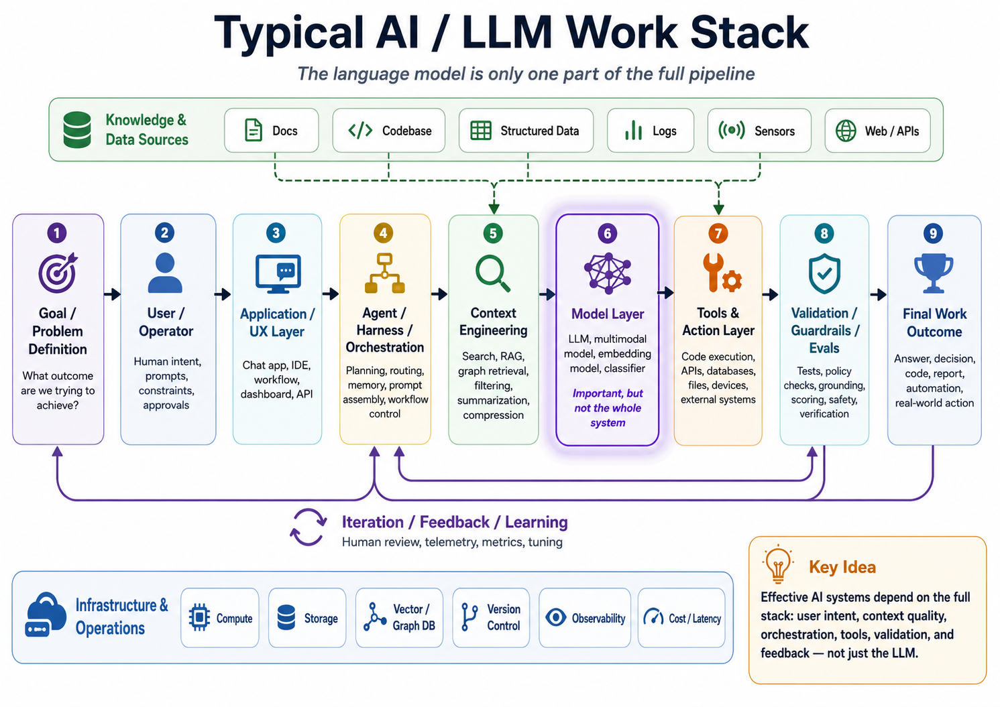

# Proposed Course Project Direction

## Local LLM Work Stack and RotoQuant KV-Cache Compression Evaluation

**Student:** Donald Lafont
**Course:** Language Models
**Project Status:** Proposed direction for instructor feedback

---

## 1. Introductory Summary

My current project direction is based on the idea that a useful AI or LLM-based system is not just the language model by itself. The language model is one important part of a larger work stack that includes the user objective, the application or interface, the agent/harness layer, context engineering, the model layer, tools, validation, infrastructure, and final work outcome.

The attached work-stack diagram summarizes this view.

In this stack, the LLM is important, but it is not the complete system. The quality of the final result depends on how well the surrounding layers manage the objective, retrieve or compress context, assemble prompts, use tools, validate outputs, and measure performance.

This is especially important for local LLM workflows, where compute, memory, context length, and latency are much more constrained than when using large cloud-based models.

---

## 2. Project Motivation

A practical industry concern I see is that token and context efficiency are becoming major limiting factors in LLM-based systems. As models are used for larger workflows, especially coding agents and codebase analysis tools, the challenge is no longer only whether the model is capable. The surrounding system must also determine how to provide the right context efficiently and reliably.

There are several related problems:

- Large context windows can be expensive, slow, and memory-intensive.
- More context does not always mean better context.
- Important information can be lost, buried, truncated, or poorly retrieved.
- Local models have stricter compute and VRAM limits.
- KV-cache memory can become a major bottleneck during long-context inference.
- Large codebases require structural understanding, not just semantic similarity.

My longer-term goal is to work toward a more complete local AI/LLM work stack that can run on my own machine without relying entirely on cloud-based language model services. However, I do not think it is realistic to build the complete stack within the course timeline.

For this course, I would like to focus on one important and measurable component of that larger goal:

> **Evaluating KV-cache/context compression methods for local LLM workflows, starting with RotoQuant-style compression compared against a standard uncompressed KV-cache baseline.**

---

## 3. Where This Fits in the AI / LLM Work Stack

The proposed work mainly fits into the following parts of the stack:

| Work Stack Block                          | Relevance to This Project                                                                                    |
| ----------------------------------------- | ------------------------------------------------------------------------------------------------------------ |
| **Context Engineering**             | The project evaluates how context can be represented, preserved, compressed, and measured.                   |
| **Model Layer**                     | The project focuses on local LLM inference and how KV-cache compression affects model behavior.              |
| **Agent / Harness / Orchestration** | The evaluation harness will coordinate test runs, compare methods, and collect metrics.                      |
| **Validation / Guardrails / Evals** | The main deliverable is an evaluation process that measures memory, speed, recall, and context quality.      |
| **Infrastructure & Operations**     | The project is grounded in practical local hardware constraints, including GPU VRAM and latency.             |
| **Final Work Outcome**              | The desired outcome is evidence about whether compression makes local long-context workflows more practical. |

This project is not intended to build every layer of the stack during the course. Instead, I plan to use existing tools and components where practical so that the project can stay focused on compression evaluation and measurable results.

---

## 4. Proposed Project Objective

The proposed objective is:

> **Build an evaluation harness for local LLM KV-cache/context compression, starting with standard uncompressed inference versus RotoQuant-style compression, and measure how this affects memory usage, latency, token efficiency, and context quality for long-context and large-codebase-oriented tasks.**

The project would begin with a controlled comparison:

1. Run a local model using the normal uncompressed KV-cache path.
2. Run the same or comparable tests using a RotoQuant-style KV-cache compression path.
3. Compare memory usage, speed, token throughput, context recall, and output quality.
4. Validate the measured results against publicly claimed or published results where possible.
5. Extend toward codebase-oriented tests if the initial setup is successful.

---

## 5. Proposed Local Test Environment

The practical local-machine track would likely use:

| Component                   | Proposed Choice                               |
| --------------------------- | --------------------------------------------- |
| Inference Runtime           | `llama.cpp`                                 |
| Local GPU                   | NVIDIA RTX 3070                               |
| VRAM                        | 8 GB                                          |
| Primary Model Candidate     | Qwen2.5-Coder 7B Instruct GGUF                |
| Secondary Model Candidate   | Llama 3.1 8B Instruct GGUF                    |
| Quantization Starting Point | Q4_K_M or Q5_K_M depending on memory headroom |
| Main Application Area       | Large static codebase understanding           |

The reason for using `llama.cpp` is that it is widely used for local inference, supports GGUF models, and is relevant to practical local deployment. The RTX 3070 with 8 GB VRAM is capable, but constrained enough that KV-cache memory and long-context efficiency become meaningful practical issues.

---

## 6. Evaluation Tracks

I currently see the evaluation as having two tracks.

### Track A — Reproduction / Published-Claim Validation

The purpose of this track is to reproduce or approximate publicly reported RotoQuant-style KV-cache compression results as closely as possible.

The goal is not to assume that public claims are wrong, but to understand the test conditions behind them and determine whether similar results can be reproduced.

Questions for this track:

- What model, context length, and hardware were used in the published results?
- What compression ratio or method was reported?
- What memory savings were claimed?
- What latency or throughput changes were claimed?
- What quality degradation, if any, was reported?
- Can I reproduce similar trends under comparable conditions?

### Track B — Practical Local-Machine Evaluation

The purpose of this track is to test whether those results hold under my own practical local environment.

Questions for this track:

- Does KV-cache compression make longer context practical on an 8 GB VRAM GPU?
- How much memory is saved in a realistic local setup?
- Does token throughput improve or degrade?
- At what context length does the uncompressed baseline become impractical?
- At what compression level does answer quality begin to break?
- Does the method still work for codebase-style tasks?

---

## 7. Candidate Evaluation Metrics

The first set of metrics should include both performance metrics and quality metrics.

| Metric Category                  | Example Metrics                                                            |
| -------------------------------- | -------------------------------------------------------------------------- |
| **Memory**                 | KV-cache memory usage, total VRAM usage, peak memory                       |
| **Performance**            | tokens/sec, prefill time, decode time, total latency                       |
| **Context Capacity**       | maximum usable context length before failure or slowdown                   |
| **Recall**                 | needle/passkey retrieval accuracy, position sensitivity                    |
| **Codebase Understanding** | ability to identify relevant files, functions, symbols, or relationships   |
| **Quality Degradation**    | where compressed context begins to produce incorrect or incomplete outputs |
| **Reproducibility Gap**    | difference between published claims and local measured results             |

The project should avoid relying only on speed or memory improvements. A compression method is only useful if it preserves enough information for the model or agent to complete the task correctly.

---

## 8. Candidate Testing Methods

I would like to begin with recognized or commonly used long-context evaluation patterns, then move toward codebase-focused testing.

### 8.1 Long-Context Baseline Tests

These would be used as early sanity checks.

Examples:

- Needle-in-the-haystack retrieval
- Passkey retrieval
- Multi-needle retrieval
- Position-bias testing
- Lost-in-the-middle testing

These tests help answer:

> Can the model still retrieve key information from long context after KV-cache compression?

### 8.2 Codebase-Oriented Tests

These are more aligned with my main interest.

Examples:

- Retrieve the correct file from a large codebase context.
- Identify the correct function or symbol.
- Trace a dependency or call relationship.
- Match a test file to the production code it validates.
- Answer code-comprehension questions over long code context.
- Determine whether compressed context preserves enough structure for useful code reasoning.

These tests help answer:

> Does KV-cache compression preserve the type of information needed for large-codebase understanding?

---

## 9. Initial Scope Boundary

To keep the project manageable, the initial scope would be:

1. Focus on **standard uncompressed KV-cache versus RotoQuant-style KV-cache compression**.
2. Use existing benchmark tools or test frameworks where possible.
3. Use `llama.cpp` and local GGUF models as the practical runtime target.
4. Start with simpler long-context recall tests.
5. Move toward codebase-style tests if the initial comparison is working.
6. Treat other KV-cache compression algorithms as future work unless time allows.

At this stage, I do not want to commit to comparing many compression algorithms. The landscape is moving quickly, and there are several proposed methods. My first goal is to validate whether I can set up the testing environment and produce meaningful comparison metrics for one compression method against the uncompressed baseline.

---

## 10. Possible Future Extensions

If the initial course scope progresses well, possible extensions could include:

- Compare additional KV-cache compression algorithms.
- Add graph-based codebase retrieval as part of the context pipeline.
- Compare vector RAG versus graph retrieval for codebase context selection.
- Add an agent/harness workflow around the compressed local model.
- Build a small dashboard for benchmark visualization.
- Extend testing to larger code-oriented models or smaller models with longer context.
- Measure context quality inside a local coding-agent workflow.

These are not part of the initial commitment, but they fit the longer-term goal of building a complete local AI/LLM work stack.

---

## 11. Why This Aligns With the Course

Although this is more ambitious than the baseline text-classification project, I believe it aligns with the course because it directly involves:

- language model internals
- token and context behavior
- local inference
- model performance evaluation
- context quality
- long-context limitations
- AI harness design
- practical tradeoffs in LLM system design

The course emphasizes that the project should demonstrate not only working code, but also reasoning, design decisions, iteration, and understanding of how language model concepts apply to the project. This project would require explaining how KV-cache behavior, context length, token efficiency, compression, and evaluation methods affect the usefulness of a local LLM system.

---

## 12. Questions for Instructor Feedback

I would appreciate feedback on the following:

1. Does this project direction fit the course expectations, even though it is more systems/evaluation focused than the baseline text-classification example?
2. Is the proposed scope reasonable if I start with uncompressed KV-cache versus RotoQuant-style compression only?
3. Would long-context recall tests plus codebase-oriented context tests be acceptable evaluation targets?
4. Should I keep the first milestone focused only on reproducing published metrics, or should I also include my local-machine practical evaluation from the start?
5. Is it acceptable to use existing tools and frameworks for the surrounding harness so that my main focus remains on compression evaluation?
6. Would this be considered sufficiently connected to course topics such as tokenization, context, embeddings/retrieval, model behavior, and evaluation?

---

## 13. Reference Material

The RotoQuant paper for the KV cache compression method:

[RotoQuant Paper
](https://arxiv.org/pdf/2511.10645)

Github RotoQuant reference code:

[RotoQuant Github Repo](https://github.com/scrya-com/rotorquant/blob/main/README.md)

Additional references to be added during further research will include long-context evaluation benchmarks such as needle-in-the-haystack, passkey retrieval, multi-needle tests, and codebase-oriented long-context benchmarks.

---

## 14. Short Version

My proposed project is to evaluate whether RotoQuant-style KV-cache compression can make local long-context LLM inference more practical, especially for large-codebase understanding tasks.

The project would compare standard uncompressed KV-cache inference against compressed KV-cache inference using `llama.cpp` on my local RTX 3070 8 GB GPU. The evaluation would measure memory usage, latency, token throughput, long-context recall, and context quality. The first goal would be to validate published-style claims where possible, then test whether the method remains useful under my practical local-machine constraints.

The larger goal is to use this as one focused component of a future complete local AI/LLM work stack.
